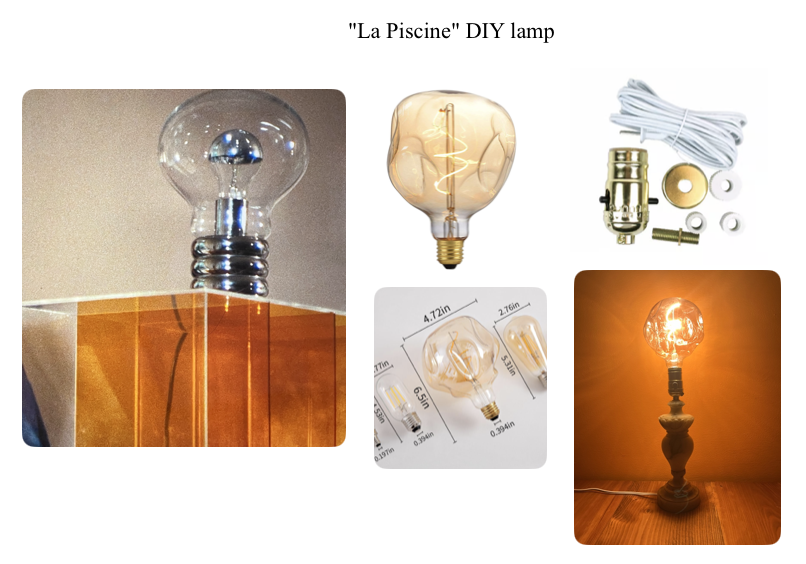
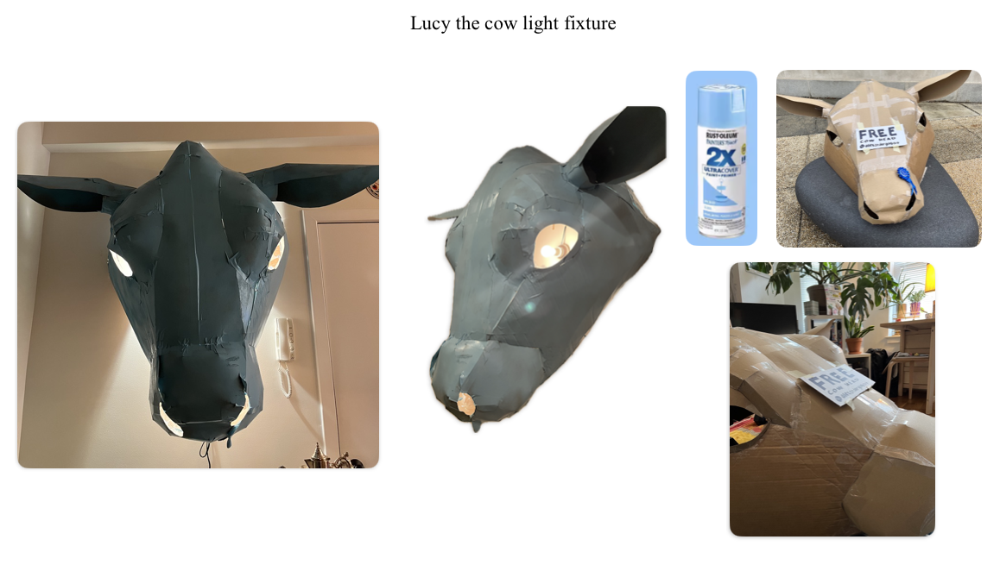
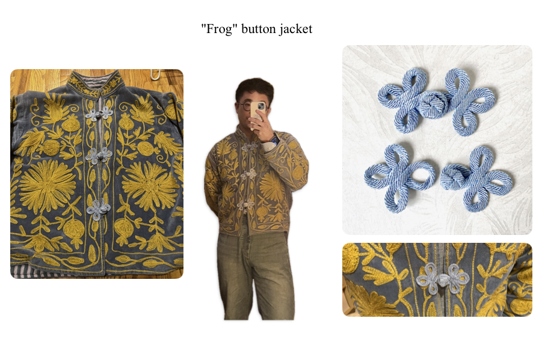
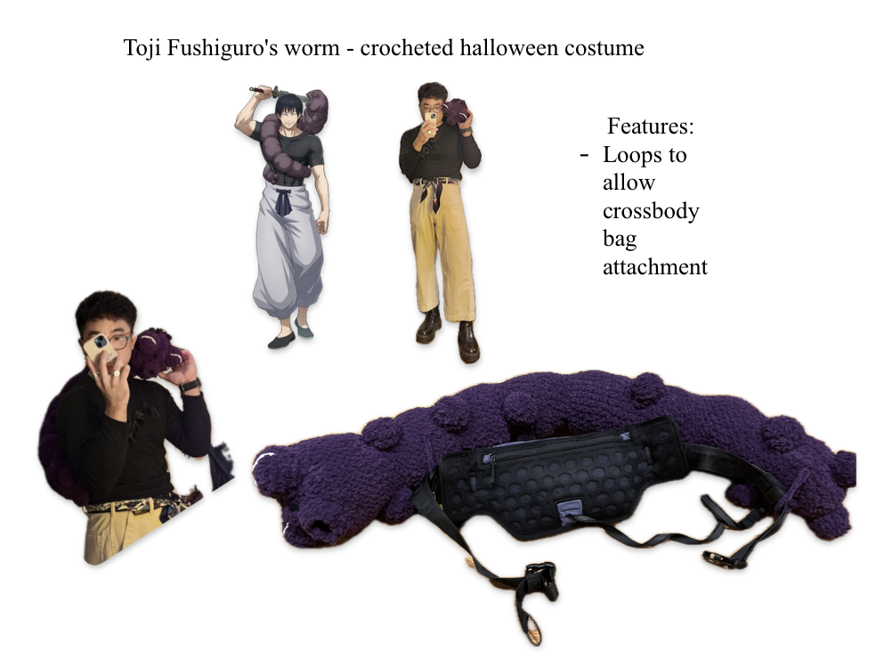

## things I've made.

<!-- ============================================================
     ART PROJECT CARDS

     Each .art-card is one project. Structure:
     ┌──────────────────────────────────────────────┐
     │  .art-card-header  (image + date/brief)      │
     │    .art-hero        → your project photo      │
     │    .art-meta         → date + one-line brief   │
     ├──────────────┬───────────────────────────────│
     │  .art-col    │  .art-col                      │
     │  label + text│  label + text                  │
     └──────────────┴───────────────────────────────┘

     The two column labels are whatever you want per project.
     See BLANK TEMPLATE at the bottom of this file.
     ============================================================ -->
 

<!-- PROJECT: lamp -->

2026
DIY "La Piscine" lamp

Inspiration

An italian marble lamp from an estate sale was unfortunately missing it's original lamp shade. Inspired by a beautiful lamp from the french movie "La Piscine."

Process

I DIY'd the lamp by stripping entirely & replaced the innards from an Ace Hardware kit. Realized how simple most lamps are to construct! Found the large e-edison bulb online.

<!-- PROJECT: lucy lamp -->

2025
"Lucy the cow" light fixture

Concept

An artist was giving a cardboard cow head away for free in Washington, D.C. I took it home & wanted to upcycle the piece. 

Process

Always in need of interesting lighting so I decided to turn Lucy into a light fixture. I painted her baby blue to match Lucy's personality.

<!-- PROJECT: Frog Button Jacket -->

2025
Customizing an embroidered jacket with vintage Chinese frog closures.

Materials

1960's period Chinese rayon frog loop closures (Rose Mille). Width: 2", Length: 3-3/8". Sourced from Rose Mille.

Process

My jacket needed some closures. Hand-sewn onto existing button plackets. Paired silver-blue knotwork against the gold floral embroidery for contrast.

<!-- PROJECT: Toji's worm -->

2025
Crocheted custom Toji's worm for Halloween.

Concept

I was reflecting on cute DIY halloween constumes while watching the latest episode of the anime Jujutsu Kaisen. I realized a Toji's worm would be a perfect complement to my existing wardrobe pieces.

Process

I mocked up a general concept and style. My lover crocheted it for me in like 48 hours!! Concept to art...

<!--
BLANK TEMPLATE — copy between the CUT lines, paste above, fill in.

─── CUT ───

YEAR
ONE SENTENCE BRIEF.

LABEL_1

DESCRIPTION_1

LABEL_2

DESCRIPTION_2

─── CUT ───
-->
