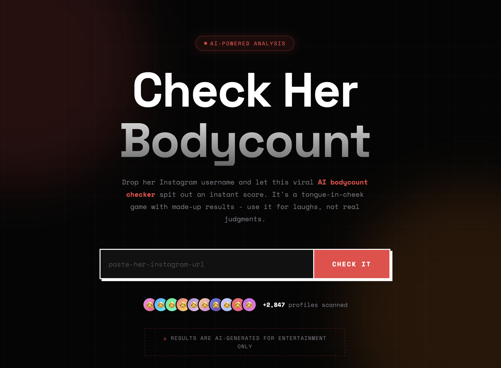
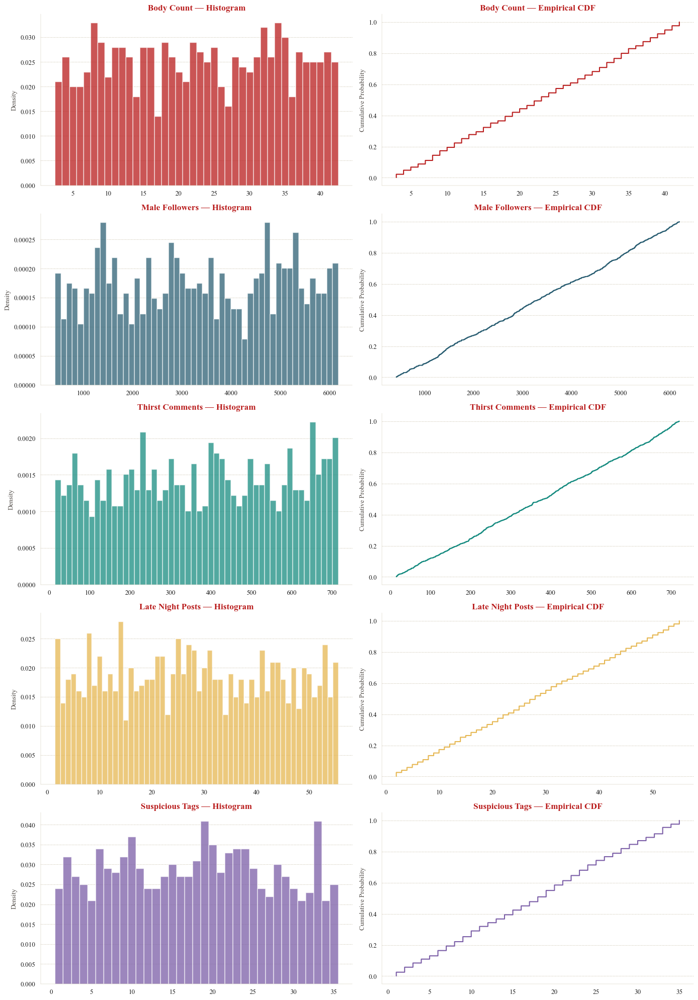
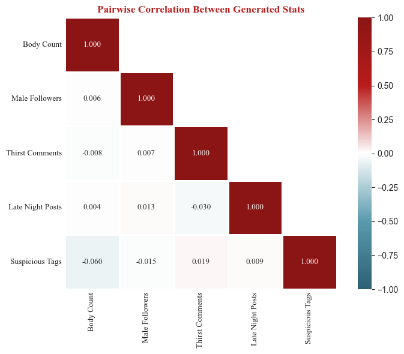
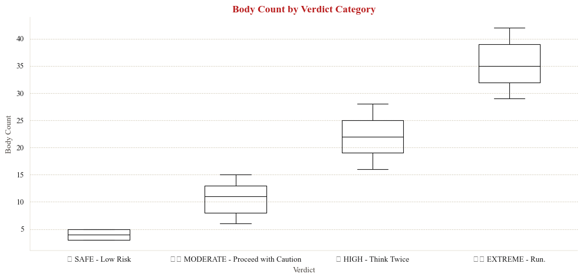

## tldr!

[A viral misogynistic site "Check Her Body Count"](https://web.archive.org/web/20260304203624/https://mashable.com/article/check-her-body-count-website) claimed to use AI to estimate the number of partners from an Instagram handle. It doesn't. Independent developers confirmed the site is run entirely client-side; it makes no API calls, doesn't validate whether a handle exists, and simply generates random numbers.

I had a specific question. If the website does generate random numbers, what probability distribution generates said random numbers? Is it uniform? Bell-shaped? Poisson? Exponential?

I collected 1,000 samples from the site and used maximum likelihood estimation, AIC/BIC model comparison, and goodness-of-fit testing to determine which probability distributions best explain the outputs. All five generated statistics follow **discrete uniform distributions**, the simplest possible RNG pattern, likely implemented as `Math.floor(Math.random() * (max - min + 1)) + min` with a different [*min, max*] range per stat.

## 1. introduction

In late February 2026, [a misogynistic website called **checkherbodycount.com**](https://web.archive.org/web/20260304203624/https://mashable.com/article/check-her-body-count-website) claiming to estimate body count from an Instagram handle using AI went viral online. It is, of course, complete fiction, and harmful fiction at that.

Independent developers quickly confirmed it's entirely a hoax:
- The site runs **100% client-side** in the browser
- It makes **zero requests** to Instagram or any external API, and does not validate whether a handle even exists
- It **generates random numbers** and **caches them in localStorage**.



Per query, the site generates **five** fake statistics:

| Stat | Element ID | Example |
|---|---|---|
| Body Count | `#resultNumber` | 17 |
| Male Followers | `#statFollowers` | 2,585 |
| Thirst Comments | `#statComments` | 270 |
| Late Night Posts | `#statLateNight` | 5 |
| Suspicious Tags | `#statSuspicious` | 17 |

Along with a verdict string ("LOW", "MEDIUM", "HIGH") and a visual risk meter.

However, as a quant, I had a different question. Specifically:

> **What probability distribution(s) does the site's random number generator use? Are all five statistics drawn from the same distribution, or do they differ? And can the exact parameters be recovered from the output?**

By collecting a sample of the site's output and applying standard statistical tools, maximum likelihood estimation, information-theoretic model comparison, and formal goodness-of-fit tests, the RNG can be reverse-engineered.

The analysis is organized as follows:

1. (this) intro
2. methodology
3. descriptive & visual exploration
4. empirical analysis, incl. results of tests
5. verdict & concluding thoughts

## 2. methodology

### 2.1 data collection

I used a headless browser (Puppeteer) to automate 1,000 queries to the site, each with a unique, randomly generated Instagram handle (e.g., alex48291_vibes). Each unique handle returns a sample of all five statistics. Between queries, `localStorage` is cleared to prevent caching from linking results across handles.

**key design decisions:**

- Handles are randomly generated (e.g., `alex48291_vibes`) to avoid any pattern that could bias a hash-based RNG. If the site seeds its generator from a hash of the input, patterned handles (e.g., test_001, test_002) could introduce spurious structure.
- Each handle is used exactly once → independent samples
- All five stats are captured + the verdict string (e.g., "LOW", "HIGH") per query

The target sample size of 1,000 was chosen to ensure adequate statistical power for the chi-squared goodness-of-fit test. With the observed ranges, 1,000 samples provide sufficient expected cell counts across bins, though as discussed in Section 4.2, the widest-range variables still present challenges.

### 2.2 candidate distributions

Seven probability distributions were tested, each representing a plausible RNG implementation the site could use:

| Distribution | What it would imply | Typical JS implementation |
|---|---|---|
| **Discrete Uniform** | Every integer in [a, b] equally likely | `Math.floor(Math.random() * (b-a+1)) + a` |
| **Normal** | Bell-curve centered on some value | Box-Muller transform on `Math.random()` |
| **Poisson** | Random count with fixed average rate | Knuth's algorithm with cumulative products |
| **Geometric** | Repeated Bernoulli trials | Inverse transform sampling |
| **Exponential** | Memoryless decay, right-skewed | `-β * Math.log(Math.random())` |
| **Log-Normal** | Multiplicative random effects | `Math.exp(μ + σ * normalRandom())` |
| **Negative Binomial** | Overdispersed count data | Gamma-Poisson mixture |

The first, Discrete Uniform, is the simplest possible pattern and what independent developers suspected from inspecting the client-side code. The remaining six represent progressively more complex alternatives that would require additional code to implement.

### 2.3 fitting & testing

For each of the five statistics and each candidate distribution, the analysis proceeds in three stages:

1. Parameter estimation. Distribution parameters are fit via Maximum Likelihood Estimation (MLE), which finds the parameter values that make the observed data most probable under each candidate.
2. Model ranking. Candidates are ranked using AIC (Akaike Information Criterion) and BIC (Bayesian Information Criterion). Both metrics balance goodness-of-fit and penalize complexity: more parameters must meaningfully improve fit to be preferred. Lower values indicate better models. Typically, a model with ΔAIC > 10 has essentially no support.
3. Goodness-of-fit testing. AIC ranks models relative to each other but does not indicate whether any model fits well in absolute terms. To address this, formal hypothesis tests are applied:
    a. Chi-squared test for discrete distributions -> bins the data and compares observed versus expected counts under the fitted distribution.
    b. Kolmogorov-Smirnov (KS) test for continuous distributions -> compares the empirical CDF to the theoretical CDF. **KS tests are approximate here, as the data are discrete**.


## 3. descriptive & visual exploration

### 3.1 descriptive statistics

Before fitting any models, the shape of each variable was examined using three diagnostic quantities:

- **Skewness ≈ 0** → indicates symmetry, which is consistent with uniform or normal distributions but rules out exponential and geometric distributions (both right-skewed by construction).
- **Kurtosis < 0 (platykurtic)** → indicates a distribution flatter than normal. The uniform distribution has a theoretical excess kurtosis of −1.2, a useful benchmark for comparison.
- **Variance/Mean ratio >> 1** → indicates overdispersion relative to a Poisson distribution, which requires the variance to equal the mean. Ratios far above 1 effectively rule out Poisson.

| Variable | N | Min | Max | Range | Mean | Median | Std Dev | Skewness | Ex. Kurtosis | Var/Mean |
|---|---|---|---|---|---|---|---|---|---|---|
| Body Count | 1000 | 3 | 42 | 39 | 22.8 | 23.0 | 11.5 | −0.0193 | −1.2270 | 5.85 |
| Male Followers | 1000 | 423 | 6200 | 5777 | 3360.5 | 3352.5 | 1681.1 | −0.0190 | −1.2330 | 840.98 |
| Thirst Comments | 1000 | 15 | 720 | 705 | 377.1 | 383.5 | 206.1 | −0.0376 | −1.1998 | 112.62 |
| Late Night Posts | 1000 | 2 | 55 | 53 | 28.2 | 28.0 | 15.6 | 0.0328 | −1.1771 | 8.59 |
| Suspicious Tags | 1000 | 1 | 35 | 34 | 17.9 | 18.0 | 9.8 | 0.0134 | −1.1334 | 5.43 |

Across all five variables, skewness hovers near 0 (max |skew| = 0.038) and excess kurtosis clusters near −1.2, closely matching the theoretical discrete uniform benchmark. Combined with high variance-to-mean ratios, this effectively rules out Poisson and strongly suggests a uniform distribution.

Before any formal model fitting, the descriptive statistics alone point strongly toward a uniform distribution. The question for Section 4 is whether this initial impression survives rigorous testing.

### 3.2 visual overview

A side-by-side look at the histogram and CDF of all five variables.



The histograms confirm the flat, roughly equal-frequency shape expected of uniform distributions. No variable shows the bell-shaped concentration of a normal, the right-skew of an exponential, or the peaked shape of a Poisson.

The empirical CDFs reinforce this reading. A discrete uniform distribution produces a staircase CDF with evenly spaced, equal-height steps, which is exactly what all five panels display. By contrast, a normal distribution would produce the characteristic S-shaped sigmoid, and an exponential would rise steeply then flatten. Neither pattern appears.

Together, the descriptive statistics and visual inspection provide strong preliminary evidence that all five variables follow discrete uniform distributions with different [min, max] ranges. The formal model fitting in Section 4 will test whether this conclusion holds under maximum likelihood estimation and hypothesis testing.

## 4. empirical analysis

### 4.1 maximum likelihood estimation (mle) & model ranking

For each of the five statistics, all seven candidate distributions were fit via MLE and ranked by AIC. 
The results are unambiguous: Discrete Uniform ranks first for all five variables, with margins large enough to rule out alternatives. Shown below is the table for the first variable. The remaining four variables follow the same pattern; full results are in [Appendix tables 1](/essay/essay_2026-03-15.html#appendix-tables-1-mle).

*Body Count — Distribution Fit*

| Rank | Distribution | Parameters | Log-Lik | AIC | BIC |
|---|---|---|---|---|---|
| 1 | Discrete Uniform | Uniform(3, 42) | -3688.879454 | 7381.758908 | 7391.574419 |
| 2 | Normal | Normal(μ=22.8, σ=11.5) | -3864.309690 | 7732.619380 | 7742.434891 |
| 3 | Neg. Binomial | NegBin(n=4.7, p=0.1709) | -3892.039173 | 7788.078347 | 7797.893857 |
| 4 | Log-Normal | LogNormal(σ=0.67, scale=19.0) | -3963.279759 | 7930.559517 | 7940.375028 |
| 5 | Geometric | Geometric(p=0.0482) | -4008.744424 | 8019.488848 | 8024.396603 |
| 6 | Exponential | Exponential(β=22.8) | -4125.180341 | 8252.360681 | 8257.268437 |
| 7 | Poisson | Poisson(λ=22.8) | -5631.539201 | 11265.078402 | 11269.986157 |

🏆 Best: Discrete Uniform — Uniform(3, 42)

A few observable trends of note. First, the ranking order is nearly identical across all five variables: Discrete Uniform first, Normal second, Negative Binomial third, with Poisson consistently last by an enormous margin. This consistency suggests a single underlying RNG pattern applied with different parameters per stat.

Second, the ΔAIC between first and second place ranges from 300.9 to 374.3. Recall from Section 2.3 that a ΔAIC > 10 overwhelmingly suggests the model has no support. These margins exceed that threshold by more than an order of magnitude; the evidence for Discrete Uniform is overwhelming.

Third, the Poisson distribution deserves special mention. For Male Followers (λ = 3360.5) and Thirst Comments (λ = 377.1), the Poisson log-likelihoods are extremley poor (−468,168 and −68,172 respectively). This is expected: the Poisson distribution requires the variance to equal the mean, but these variables have variance-to-mean ratios of 841 and 113. The collected data is overdispersed for Poisson.

### 4.2 goodness-of-fit (gof) tests

AIC ranks models relative to each other, but doesn't tell us if any model is actually *good* in absolute terms. For that I used formal hypothesis tests:

- **Chi-squared test** (discrete distributions): bins data and compares observed vs expected counts
- **Kolmogorov-Smirnov test** (continuous distributions): compares the empirical CDF to the theoretical CDF

In both tests, the null hypothesis, H0, is that the data follows the candidate distribution; a p-value above α = 0.05 means the distribution cannot be rejected. Shown below is the table for the first variable. The remaining four variables follow the same pattern; full results are in [Appendix tables 2](/essay/essay_2026-03-15.html#appendix-tables-2-gof-tests).

Body Count — Goodness-of-Fit Tests

| | Distribution | Test | Statistic | p-value | Result |
|---|---|---|---|---|---|
| 0 | Discrete Uniform | χ² | 29.680000 | 8.590930e-01 | ✓ Pass |
| 1 | Normal | KS | 0.081390 | 3.283897e-06 | ✗ Reject |
| 2 | Poisson | χ² | 811.023224 | 2.628034e-157 | ✗ Reject |
| 3 | Exponential | KS | 0.189205 | 8.056775e-32 | ✗ Reject |
| 4 | Log-Normal | KS | 0.123700 | 8.544502e-14 | ✗ Reject |

The results split into two groups. For Body Count, Late Night Posts, and Suspicious Tags, the chi-squared test passes comfortably for Discrete Uniform (p = 0.86, 0.89, and 0.50 respectively) while every alternative distribution is rejected with p-values below 10⁻⁵. These are clean results; the data is consistent with a uniform distribution and inconsistent with everything else tested.

For Male Followers and Thirst Comments, the chi-squared test for Discrete Uniform returns NaN, a likely methodological issue. The chi-squared test requires binning the data and comparing observed versus expected frequencies; the standard rule of thumb is that each bin should have an expected count of at least 5. Male Followers spans a range of 5,777 unique values and Thirst Comments spans 705. With 1,000 observations spread across thousands of possible values, most bins contain 0 or 1 observations, and the test statistic becomes undefined. This is a known limitation of the chi-squared test for wide-range discrete uniform distributions. 

However, several lines of evidence still support Discrete Uniform:
- AIC dominance. Discrete Uniform leads by ΔAIC of 367.7 (Male Followers) and 374.3 (Thirst Comments); the largest margins in the entire analysis.
- Descriptive statistics. Both variables show near-zero skewness and excess kurtosis of approximately −1.2, matching the theoretical uniform value.
- Visual inspection. The histograms display flat, roughly equal-frequency bars across the full range, and the CDFs show even staircase patterns.

An interesting anomaly appears in the Male Followers table: the Poisson distribution passes the chi-squared test (p = 0.41) despite ranking dead last by AIC. This occurs because with λ = 3360.5, the Poisson approximates a normal distribution (by the central limit theorem), and the chi-squared test with wide bins lacks the power to distinguish between them. 

This is actually a nice reminder that passing a goodness-of-fit test does not mean a distribution is the correct model; it means the test failed to reject it, which is a weaker claim. AIC, which penalizes the catastrophically poor log-likelihood, correctly identifies Poisson as the worst candidate.

### 4.3 pairewise correlation check

If the five statistics are generated by independent `Math.random()` calls, their pairwise correlations should be near zero. A non-trivial correlation would suggest that some stats are derived from others. For example, if one variable were derived from another (e.g., `suspicious_tags` from `body_count`), one would expect non-zero correlations.



As shown above, max absolute pairwise correlation is 0.060, which is well within the range expected from sampling noise with N = 1,000 (under independence, the standard error of a sample correlation is approximately 1/√N ≈ 0.032, so |r| < 0.06 is unremarkable).

This suggests that all stats show no evidence of linear dependence and the site runs `Math.random()` separately for each stat with no cross-dependencies.

A caveat: pairwise Pearson correlation captures only linear relationships. However, given that all five marginal distributions are uniform, a distribution with no natural "shape" to distort, nonlinear dependencies between variables would be unusual.

### 4.4 verdict classification

The site also assigns each query a text verdict alongside the body count. If the verdict is itself randomly generated, I would expect overlapping body count ranges across verdict categories. If instead it is deterministically derived from the body count, the ranges should be cleanly separated.



The boxplot above of the four verdict categories of SAFE, MODERATE, HIGH, and EXTREME, occupy non-overlapping body count ranges. No MODERATE result has ever appeared above a body count of 15, and no HIGH result has appeared below 16. The boundaries seem to be consistent with fixed integer cutoffs:

| Verdict | Inferred Cutoff Rule |
|---|---|
| SAFE - Low Risk | body count ≤ 5 |
| MODERATE - Proceed with Caution | 6 ≤ body count ≤ 15 |
| HIGH - Think Twice | 16 ≤ body count ≤ 28 |
| EXTREME - Run. | body count ≥ 29 |

The verdict is therefore likely not a separate random variable. It is a deterministic function of the body count, implemented as a simple set of `if/else` threshold checks.

## 5. verdict & concluding thoughts

### 5.1 summary of findings

The following table consolidates the results across all five variables:

| Variable | Best Fit | Parameters | AIC | ΔAIC to #2 | Evidence | GOF p-value | GOF Result |
|---|---|---|---|---|---|---|---|
| Body Count | Discrete Uniform | Uniform(3, 42) | 7381.8 | 350.9 | Strong | 0.859093 | ✓ Pass |
| Male Followers | Discrete Uniform | Uniform(423, 6200) | 17327.6 | 367.7 | Strong | NaN | — |
| Thirst Comments | Discrete Uniform | Uniform(15, 720) | 13123.2 | 374.3 | Strong | NaN | — |
| Late Night Posts | Discrete Uniform | Uniform(2, 55) | 7982.0 | 350.6 | Strong | 0.887302 | ✓ Pass |
| Suspicious Tags | Discrete Uniform | Uniform(1, 35) | 7114.7 | 300.9 | Strong | 0.499790 | ✓ Pass |

So do all five stats use the same RNG pattern, or does the site use different distributions for different fake stats? 

### 5.2 what this means

The analysis strongly suggests that every variable is best described by a discrete uniform distribution. The AIC margins exceed 300 in all cases, well above the conventional threshold for decisive evidence. Where the chi-squared test is applicable, it confirms the fit with high p-values. The near-zero pairwise correlations further suggest that each statistic has no linear dependence, with no evidence that any variable is derived from another.

In JavaScript, this is implemented as:

```javascript
Math.floor(Math.random() * (max - min + 1)) + min
```

Each stat simply uses a different `[min, max]` range. The strongly negative excess kurtosis, near-zero skewness, dominant AIC scores, and near-zero cross-correlations all converge on the same conclusion.

The site rolls five independent digital dice, one per stat, applies a set of hard-coded cutoffs, and presents the outcome.

### 5.3 caveats & extensions

Four limitations and potential extensions are worth noting.

1. **Hash-based seeding:** If the site seeds its RNG from a hash of the username (rather than `Math.random()`), the same handle will deterministically produce the same numbers even without caching. This can be tested by querying the same handle across different browsers/devices. The *output distribution* of a good hash function is still approximately uniform, so our conclusion holds either way.

2. **Correlation structure:** The correlation analysis tests only linear association. While nonlinear dependencies are unlikely given the uniform marginals and the site's minimal codebase, a more rigorous test using mutual information or distance correlation could provide stronger confirmation of independence.

3. **Sample size & test power:** The chi-squared test failed for the two widest-range variables due to insufficient expected cell counts. Alternative approaches, such as a simulation-based exact test (Monte Carlo permutation test comparing the observed chi-squared statistic against simulated draws from the fitted discrete uniform), could provide formal GOF confirmation for these variables. For researchers replicating this analysis, a larger sample size would help.

4. **Likely underestimated max-min ranges:** The fitted [min, max] parameters are derived from the observed sample extremes, which may underestimate the true code-level boundaries. For a Discrete Uniform with n possible values, the probability of observing the true maximum in N samples is 1 − ((n−1)/n)^N. 
    - For narrow-range variables (Body Count, Late Night Posts, Suspicious Tags), 1,000 samples is likely sufficient, and the probability of missing a boundary value is small. 
    - For wide-range variables, however, sampling coverage is sparse. Male Followers spans an estimated 5,778 unique values; with 1,000 samples, the probability of observing the true maximum is only ~16%, and likewise for the minimum. The true range for this variable is almost certainly wider than the observed [423, 6200] — plausible code-level boundaries might be round numbers like [0, 6500] or [500, 6500]. The same concern applies to Thirst Comments, though less severely. A larger sample (10,000+) or direct inspection of the site's JavaScript source would resolve this.

## references

★ Akaike, H. (1974). A new look at the statistical model identification.
  IEEE Transactions on Automatic Control, 19(6), 716–723.

★ Britt, T. (2026). Site to 'check' women's 'body counts' goes viral — and some men are defending it. Mashable. https://web.archive.org/web/20260304203624/https://mashable.com/article/check-her-body-count-website

★ Burnham, K. P., & Anderson, D. R. (2002). Model Selection and Multimodel
  Inference: A Practical Information-Theoretic Approach (2nd ed.).
  Springer-Verlag. ISBN 978-0-387-95364-9.

★ Knuth, D. E. (1997). The Art of Computer Programming, Volume 2:
  Seminumerical Algorithms (3rd ed.). Addison-Wesley.

★ Massey, F. J. (1951). The Kolmogorov-Smirnov test for goodness of fit.
  Journal of the American Statistical Association, 46(253), 68–78.

★ Pearson, K. (1900). On the criterion that a given system of deviations
  from the probable in the case of a correlated system of variables is such
  that it can be reasonably supposed to have arisen from random sampling.
  Philosophical Magazine, 50(302), 157–175.

## appendix

### appendix tables 1: mle

These are the tables for the [**4.1 maximum likelihood estimation (mle) & model ranking**](/essay/essay_2026-03-15.html#maximum-likelihood-estimation-mle-model-ranking) analysis.

*Body Count — Distribution Fit*

| Rank | Distribution | Parameters | Log-Lik | AIC | BIC |
|---|---|---|---|---|---|
| 1 | Discrete Uniform | Uniform(3, 42) | -3688.879454 | 7381.758908 | 7391.574419 |
| 2 | Normal | Normal(μ=22.8, σ=11.5) | -3864.309690 | 7732.619380 | 7742.434891 |
| 3 | Neg. Binomial | NegBin(n=4.7, p=0.1709) | -3892.039173 | 7788.078347 | 7797.893857 |
| 4 | Log-Normal | LogNormal(σ=0.67, scale=19.0) | -3963.279759 | 7930.559517 | 7940.375028 |
| 5 | Geometric | Geometric(p=0.0482) | -4008.744424 | 8019.488848 | 8024.396603 |
| 6 | Exponential | Exponential(β=22.8) | -4125.180341 | 8252.360681 | 8257.268437 |
| 7 | Poisson | Poisson(λ=22.8) | -5631.539201 | 11265.078402 | 11269.986157 |

🏆 Best: Discrete Uniform — Uniform(3, 42)

*Male Followers — Distribution Fit*

| Rank | Distribution | Parameters | Log-Lik | AIC | BIC |
|---|---|---|---|---|---|
| 1 | Discrete Uniform | Uniform(423, 6200) | -8661.812881 | 17327.625762 | 17337.441273 |
| 2 | Normal | Normal(μ=3360.5, σ=1680.3) | -8845.642321 | 17695.284643 | 17705.100153 |
| 3 | Neg. Binomial | NegBin(n=4.0, p=0.0012) | -8887.450998 | 17778.901995 | 17788.717506 |
| 4 | Log-Normal | LogNormal(σ=0.65, scale=2824.4) | -8939.994728 | 17883.989457 | 17893.804967 |
| 5 | Geometric | Geometric(p=0.0003) | -8985.472779 | 17972.945559 | 17977.853314 |
| 6 | Exponential | Exponential(β=3360.5) | -9119.834934 | 18241.669868 | 18246.577623 |
| 7 | Poisson | Poisson(λ=3360.5) | -468168.136305 | 936338.272609 | 936343.180365 |

🏆 Best: Discrete Uniform — Uniform(423, 6200)

*Suspicious Tags — Distribution Fit*

| Rank | Distribution | Parameters | Log-Lik | AIC | BIC |
|---|---|---|---|---|---|
| 1 | Discrete Uniform | Uniform(1, 35) | -3555.348061 | 7114.696123 | 7124.511634 |
| 2 | Normal | Normal(μ=17.9, σ=9.8) | -3705.782292 | 7415.564583 | 7425.380094 |
| 3 | Neg. Binomial | NegBin(n=4.0, p=0.1842) | -3747.963466 | 7499.926932 | 7509.742442 |
| 4 | Geometric | Geometric(p=0.0560) | -3854.318474 | 7710.636947 | 7715.544703 |
| 5 | Log-Normal | LogNormal(σ=0.83, scale=14.0) | -3866.093469 | 7736.186938 | 7746.002449 |
| 6 | Exponential | Exponential(β=17.9) | -3882.843491 | 7767.686983 | 7772.594738 |
| 7 | Poisson | Poisson(λ=17.9) | -5330.480299 | 10662.960598 | 10667.868353 |

🏆 Best: Discrete Uniform — Uniform(1, 35)

*Thirst Comments — Distribution Fit*

| Rank | Distribution | Parameters | Log-Lik | AIC | BIC |
|---|---|---|---|---|---|
| 1 | Discrete Uniform | Uniform(15, 720) | -6559.615237 | 13123.230475 | 13133.045986 |
| 2 | Normal | Normal(μ=377.1, σ=206.0) | -6746.748965 | 13497.497930 | 13507.313440 |
| 3 | Neg. Binomial | NegBin(n=3.4, p=0.0089) | -6842.071023 | 13688.142046 | 13697.957557 |
| 4 | Geometric | Geometric(p=0.0028) | -6893.413047 | 13788.826095 | 13793.733850 |
| 5 | Log-Normal | LogNormal(σ=0.83, scale=295.4) | -6918.746911 | 13841.493822 | 13851.309333 |
| 6 | Exponential | Exponential(β=377.1) | -6932.619123 | 13867.238246 | 13872.146001 |
| 7 | Poisson | Poisson(λ=377.1) | -68171.844671 | 136345.689342 | 136350.597098 |

🏆 Best: Discrete Uniform — Uniform(15, 720)

*Late Night Posts — Distribution Fit*

| Rank | Distribution | Parameters | Log-Lik | AIC | BIC |
|---|---|---|---|---|---|
| 1 | Discrete Uniform | Uniform(2, 55) | -3988.984047 | 7981.968093 | 7991.783604 |
| 2 | Normal | Normal(μ=28.2, σ=15.6) | -4164.298698 | 8332.597397 | 8342.412908 |
| 3 | Neg. Binomial | NegBin(n=3.7, p=0.1163) | -4204.640358 | 8413.280717 | 8423.096227 |
| 4 | Geometric | Geometric(p=0.0367) | -4285.915268 | 8573.830535 | 8578.738291 |
| 5 | Log-Normal | LogNormal(σ=0.80, scale=22.3) | -4298.474454 | 8600.948909 | 8610.764419 |
| 6 | Exponential | Exponential(β=28.2) | -4340.562343 | 8683.124686 | 8688.032442 |
| 7 | Poisson | Poisson(λ=28.2) | -7311.831685 | 14625.663369 | 14630.571125 |

🏆 Best: Discrete Uniform — Uniform(2, 55)

### appendix tables 2: gof tests

These are the tables for the [**4.2 goodness-of-fit (gof)**](/essay/essay_2026-03-15.html#goodness-of-fit-gof-tests) analysis.

Body Count — Goodness-of-Fit Tests

| | Distribution | Test | Statistic | p-value | Result |
|---|---|---|---|---|---|
| 0 | Discrete Uniform | χ² | 29.680000 | 8.590930e-01 | ✓ Pass |
| 1 | Normal | KS | 0.081390 | 3.283897e-06 | ✗ Reject |
| 2 | Poisson | χ² | 811.023224 | 2.628034e-157 | ✗ Reject |
| 3 | Exponential | KS | 0.189205 | 8.056775e-32 | ✗ Reject |
| 4 | Log-Normal | KS | 0.123700 | 8.544502e-14 | ✗ Reject |

Male Followers — Goodness-of-Fit Tests

| | Distribution | Test | Statistic | p-value | Result |
|---|---|---|---|---|---|
| 0 | Discrete Uniform | χ² | NaN | NaN | ✗ Reject |
| 1 | Normal | KS | 0.077837 | 1.023477e-05 | ✗ Reject |
| 2 | Poisson | χ² | 94.482539 | 4.088680e-01 | ✓ Pass |
| 3 | Exponential | KS | 0.187717 | 2.521115e-31 | ✗ Reject |
| 4 | Log-Normal | KS | 0.114558 | 6.884858e-12 | ✗ Reject |

Thirst Comments — Goodness-of-Fit Tests

| | Distribution | Test | Statistic | p-value | Result |
|---|---|---|---|---|---|
| 0 | Discrete Uniform | χ² | NaN | NaN | ✗ Reject |
| 1 | Normal | KS | 0.065040 | 4.029450e-04 | ✗ Reject |
| 2 | Poisson | χ² | 150.327876 | 6.645739e-09 | ✗ Reject |
| 3 | Exponential | KS | 0.175139 | 2.682286e-27 | ✗ Reject |
| 4 | Log-Normal | KS | 0.141017 | 8.205825e-18 | ✗ Reject |

Late Night Posts — Goodness-of-Fit Tests

| | Distribution | Test | Statistic | p-value | Result |
|---|---|---|---|---|---|
| 0 | Discrete Uniform | χ² | 40.904000 | 8.873015e-01 | ✓ Pass |
| 1 | Normal | KS | 0.070845 | 8.263457e-05 | ✗ Reject |
| 2 | Poisson | χ² | 246.226313 | 2.777597e-39 | ✗ Reject |
| 3 | Exponential | KS | 0.174785 | 3.447390e-27 | ✗ Reject |
| 4 | Log-Normal | KS | 0.131097 | 1.909027e-15 | ✗ Reject |

Suspicious Tags — Goodness-of-Fit Tests

| | Distribution | Test | Statistic | p-value | Result |
|---|---|---|---|---|---|
| 0 | Discrete Uniform | χ² | 33.340000 | 4.997899e-01 | ✓ Pass |
| 1 | Normal | KS | 0.076849 | 1.391566e-05 | ✗ Reject |
| 2 | Poisson | χ² | 551.128024 | 1.006710e-104 | ✗ Reject |
| 3 | Exponential | KS | 0.177266 | 5.854542e-28 | ✗ Reject |
| 4 | Log-Normal | KS | 0.143484 | 1.987062e-18 | ✗ Reject |
